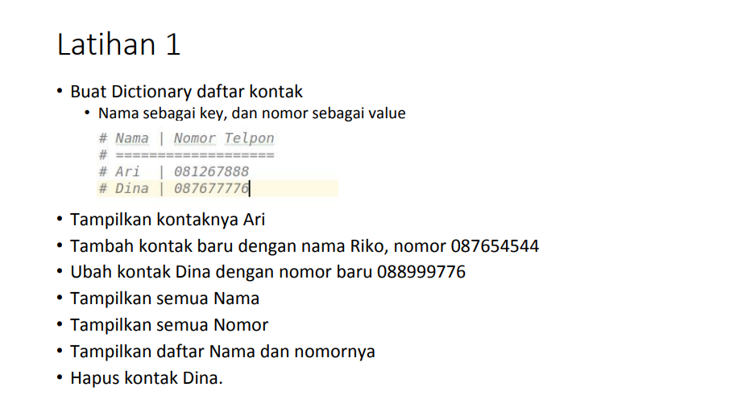

# Iman Setiawan

**Tugas Latihan - Pertemuan 10**

Berikut soal tugas dari modul.\

Dibawah ini adalah code saya\
Saya menggunakan if untuk pemilihan menunya.
~~~

x = {}

while True:
    print()
    print("Program Nomor Kontak")
    print()
    print("Ketik (1) untuk Menampilkan Data")
    print("Ketik (2) untuk Menambahkan Data")
    print("Ketik (3) untuk Mengubah Data")
    print("Ketik (4) untuk Menghapus Data")
    print("Ketik (5) untuk Menampilkan Nama saja")
    print("Ketik (6) untuk Menampilkan Nomor saja")
    
    print("--------------------------------")
    menu = input("Pilih menu> ")
    if menu == "2":
        print("Menambahkan Kontak Baru")
        nama = input("Nama\t: ")
        nomor = input("Nomor \t: ")
        x[nama] = nomor
        print("Data telah di Input !")
        input("Tekan Enter untuk ke Menu Utama. . .")

    elif menu == "1":
        print()
        print("|       Nama       | Nomor Telepon |")
        for z in x.items():
            print("|{0:17} | {1:^13} |".format(z[0], z[1],))
        input("Tekan Enter untuk ke Menu Utama. . .")
    

    elif menu == "3":
        print("Menganti Nomor Kontak")
        nama = input("Masukkan Nama\t: ")
        if nama in x.keys():
            nomor = input("Nomor\t: ")
            x[nama] = nomor
            print("Data Telah di Ubah !")
        else:
            print("Nama {0} tidak ditemukan".format(nama))
            input("Tekan Enter untuk ke Menu Utama. . .")
        input("Tekan Enter untuk ke Menu Utama. . .")
            
    elif menu == "4":
        print("Hapus Kontak")
        nama = input("Masukkan Nama  : ")
        if nama in x.keys():
            del x[nama]
            print("Data telah di hapus !")
        else:
            print("Nama {0} Tidak Ditemukan".format(nama))
        input("Tekan Enter untuk ke Menu Utama. . .")

    elif menu == "5":
        print()
        print("|       Nama       |")
        for z in x.items():
            print("|{0:17} |".format(z[0]))
        input("Tekan Enter untuk ke Menu Utama. . .")

    elif menu == "6":
        print()
        print("| Nomor Telepon |")
        for z in x.items():
            print("| {0:^13} |".format(z[1]))
        input("Tekan Enter untuk ke Menu Utama. . .")
         
        
    else:
        print("Input yang dimasukan salah")
        input("Tekan Enter untuk ke Menu Utama. . .")

~~~

Pertama saya menambahkan data kontak Ari dan Dina.\

Menambahkan data kontak baru Riko.\

Mengganti nomor kontak Dina dengan nomor baru.\

Menampilkan semua nama kontak.\

Menampilkan semua nomor telepon.\

Menampilkan semua Data.\

